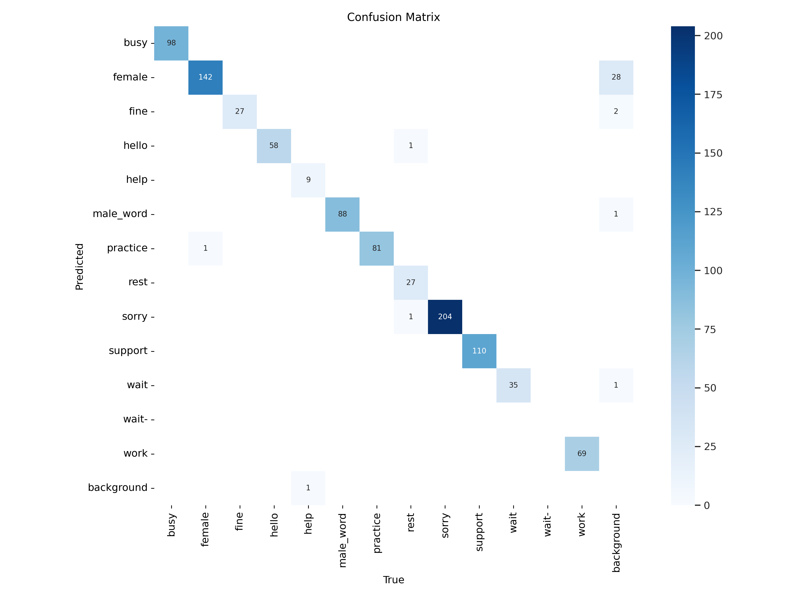
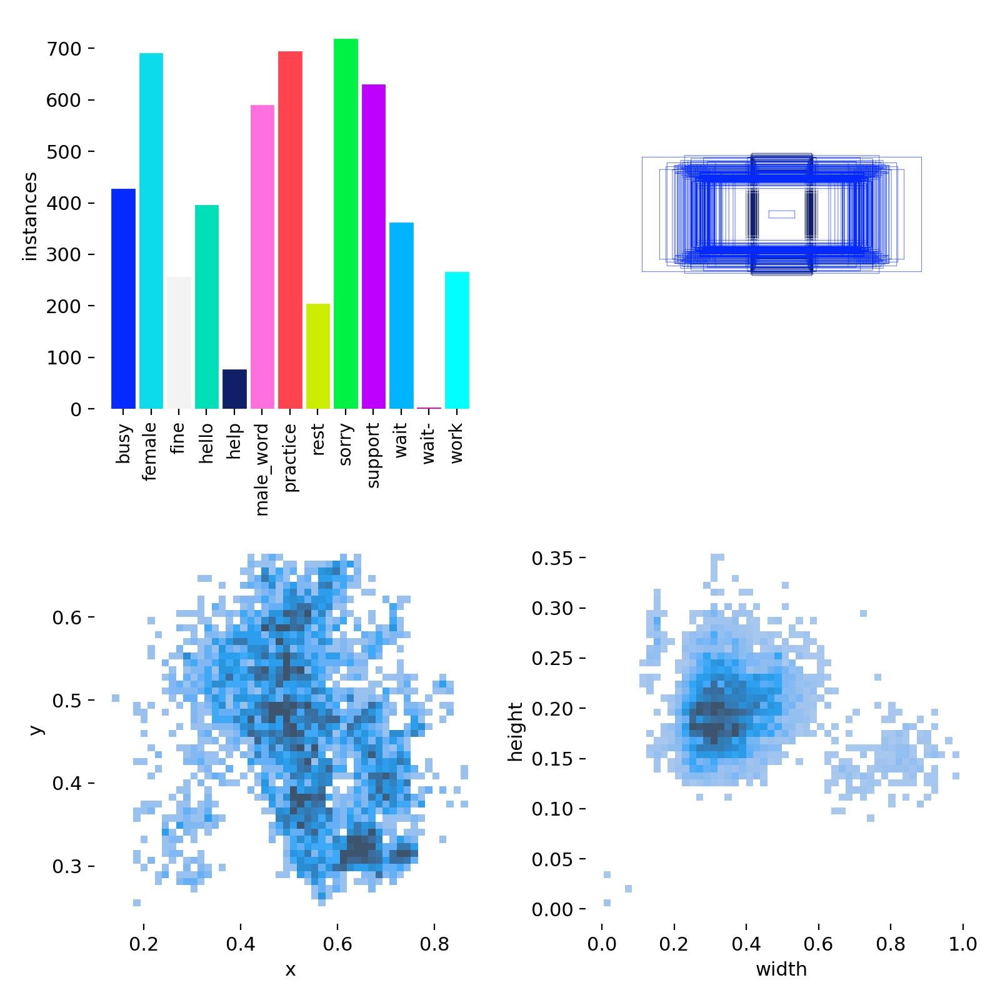
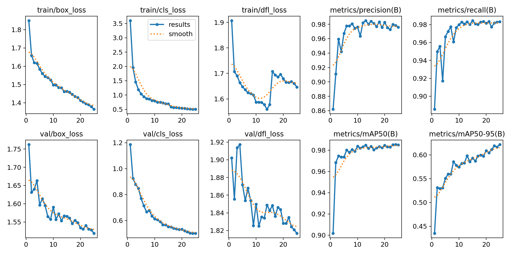

# 🧠 Multi-Model AI System for Identity Recognition and Pakistani Sign Language Detection

> A real-time intelligent system combining **Face Verification (VGG16)** and **Pakistani Sign Language (PSL) Detection (YOLOv8)** — designed to enhance accessibility and security through AI-powered assistive technology.


---

## 📌 Overview

This project proposes a secure, real-time, and modular AI system integrating:
- **Facial Verification** using VGG16 for user authentication
- **PSL Gesture Recognition** using YOLOv8 trained on 13 semantic PSL gestures
- **Hand Tracking** using MediaPipe for precise visual feedback

The system improves accessibility for the deaf community and ensures authenticated use through biometric face recognition.

---

## 🎯 Key Features

- 🔐 Face verification via pre-trained VGG16 model
- ✋ PSL gesture detection using YOLOv8 (trained on 6,578 images)
- 🎥 Real-time gesture tracking using MediaPipe
- 📈 MLflow for experiment tracking
- 🌐 Web-based Flask UI for interaction
- 🚀 CI/CD-ready (Docker, GitHub Actions, AWS/Azure deployment)

---

## 🧠 System Architecture

```mermaid
graph TD
A[User Uploads Face Image] --> B[VGG16 Face Verification]
B -->|Verified| C[YOLOv8 Gesture Detection]
C --> D[MediaPipe Landmark Tracking]
D --> E[Web UI - Real-time PSL Display]
````

---

## 🧪 Model Performance

| Model  | Accuracy | Type              |
| ------ | -------- | ----------------- |
| VGG16  | 94%      | Face Verification |
| YOLOv8 | 98%      | PSL Detection     |

---

## 📈 Model Evaluation

Below are the visual evaluation metrics from the trained YOLOv8 model:

### 📊 Confusion Matrix


### 📊 Class Labels Distribution


### 📊 YOLOv8 Evaluation Results


---

---

## 📂 Dataset

### 👤 Face Verification

* **Sources**: Custom (friends) + CelebA (male/female)
* **Classes**: 6 (4 individuals + male/female)
* **Preprocessing**: Resizing, normalization, augmentation

### 🧤 PSL Detection

* **Source**: [Roboflow](https://universe.roboflow.com/)
* **Classes**: 13 common PSL signs (e.g., "hello", "rest", "work")
* **Total Images**: 6,578 (YOLOv8 format)

---

## 🛠️ Technologies Used

| Component           | Tools / Libraries                       |
| ------------------- | --------------------------------------- |
| Model Training      | PyTorch, Ultralytics YOLOv8, TensorFlow |
| Web Interface       | Flask, HTML, CSS, JavaScript            |
| Hand Tracking       | MediaPipe                               |
| Experiment Tracking | MLflow                                  |
| Deployment          | Docker, AWS EC2/ECR, Azure ACR          |
| Version Control     | Git, GitHub Actions                     |

---

## 📁 Project Structure

```
📦Multi-Model-AI-System
├── assets/             # Demo GIFs, screenshots
├── data/               # Face & PSL datasets
├── models/             # Saved model weights
├── src/                # Core ML logic
│   ├── components/     # Pipeline components
│   ├── config/         # Config and param YAMLs
│   ├── utils/          # Helper functions
├── templates/          # HTML (Flask)
├── static/             # CSS, JS
├── app.py              # Main app entry
├── requirements.txt    
└── README.md
```

---

## ▶️ How to Run

### 🔧 Setup Environment

```bash
# Clone the repo
git clone https://github.com/Arsalan-Azhar-AI/Multi-Model-AI-System-for-Identity-Recognition-And-PSL-Detection
cd Multi-Model-AI-System-for-Identity-Recognition-And-PSL-Detection

# Create virtual environment
conda create -n multimodal-ai python=3.11 -y
conda activate multimodal-ai

# Install dependencies
pip install -r requirements.txt
```

### 🧪 Train / Run Models

#### 1. Face Verification (VGG16)

```bash
python main.py
```

#### 2. PSL Detection (YOLOv8)

```bash
yolo task=detect mode=train model=yolov8n.pt data=psl.yaml epochs=25 imgsz=640
```

### 🖥️ Launch Web App

```bash
python app.py
```

Then open `http://127.0.0.1:8080/` in browser

---

## 🚀 Deployment (AWS / Azure)

### AWS (EC2 + ECR)

* Build Docker image → Push to ECR
* Launch EC2 → Pull from ECR → Run container

### Azure (ACR + Web App)

```bash
docker build -t psl.azurecr.io/psl-app .
docker login psl.azurecr.io
docker push psl.azurecr.io/psl-app
```

* Deploy via Azure Portal

> GitHub Actions are preconfigured for CI/CD automation with Docker

---

## 📈 Experiment Tracking (MLflow)

```bash
mlflow ui
# Visit: http://127.0.0.1:5000
```

---

## 🧩 Future Improvements

* 🔄 Integrate emotion recognition
* 🌐 Add multilingual gesture translation
* 📱 Deploy on mobile (TensorFlow Lite)
* 📊 Live dashboard with real-time metrics

---

## 🙌 Contributors

* Muhammad Arsalan Azhar


---

## 📄 License

This project is licensed under the MIT License.

---

## 📬 Connect with Me

* GitHub: [@Arsalan-Azhar-AI](https://github.com/Arsalan-Azhar-AI)
* LinkedIn: [Arsalan Azhar](https://www.linkedin.com/in/arsalanazhar)


---

## 📚 References

* [YOLOv8](https://github.com/ultralytics/ultralytics)
* [CelebA Dataset](https://mmlab.ie.cuhk.edu.hk/projects/CelebA.html)
* [Roboflow PSL Dataset](https://universe.roboflow.com/)
* [MediaPipe Hands](https://google.github.io/mediapipe/solutions/hands.html)
* [MLflow](https://mlflow.org)


